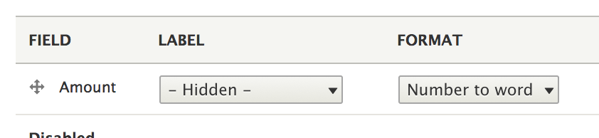

# Test Project

This is the solution of the test given.

## Requirements

We require you to develop a cheque writing web application consisting of one or more web pages that perform the following function:
* Capture a person’s name and a number
* Produce a cheque that contains
    * Customers name
    * Amount in currency
    * Amount in grammatically correct English
* Input must handle values from zero to 100 trillion
* Application must handle invalid input gracefully

## Example 
For example:

Input:	John Smith
		145023.45

Output:	John Smith<br>
        $145,023.45<br>
		ONE HUNDRED AND FOURTY-FIVE THOUSAND, TWENTY-THREE DOLLARS AND FORTY-FIVE CENTS


## Getting Started

These instructions will get you a copy of the project up and running on your local machine for development and testing purposes.

### Prerequisites

What things you need to install the software and how to install them

* Working *AMP - Meaning you should have Apache. Mysql and PHP running on your
local.
* Setup a vhost for this install.
* Create a database on your local.

### Installing

Go to the htdocs of your *AMP setup.

`git clone git@github.com:gargsuchi/test.git test`<br>
`cd test`
`vi sites/default/settings.php`
 
 ```angular2html
$databases['default']['default'] = array (  
  'database' => '<dbname>',  
   'username' => '<dbuser>',  
   'password' => '<dbpass>',  
   'prefix' => '',  
   'host' => '127.0.0.1',  
   'port' => '<dbport>',  
   'namespace' => 'Drupal\\Core\\Database\\Driver\\mysql',  
   'driver' => 'mysql',  
 ); 


```
 Change dbname, dbuser, dbpass and dbport in the code snippet above
 and save settings.php.

Now you need to install Drupal. 

Make sure that vhost etc are configured. Now go to the vhost on your local.
`http://test.localhost.com`

Drupal install will be initiated.  

Please select the profile *Configuration installer*

Proceed with the Drupal Installation.

### Next Steps

The way I have tried to achieve the needful is by creating a custom numeric 
formatter.  
The code can be seen in the custom module `number_to_word` 


To start, as an anonymous user, go to `/node/add/article` 


Now login as admin into the the Drupal install and go to `/admin/structure/types/manage/article/display`

This is the new field formatter.


And these are settings.


The advantage of using this formatter was that this can be applied to any field 
as per the choice of the choice of the site builder.

To deploy this formatter on any other system, you just need to take the custom module specified above and enable it.
